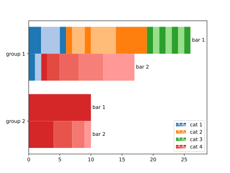

# Fancy barchart

Produce grouped, stacked horizontal barcharts.

## Demo

```python
import matplotlib.pyplot as plt
from fancy_barchart.barchart import chart
c = {
    "group 1": {
        "bar 1": {"cat 1": [2,3,1], "cat 2": [1,2,1,4,5], "cat 3": [1,1,1,1,1,1,1]},
        "bar 2": {"cat 1": [1,1], "cat 4": [1,2,3,4,5]},
    },
    "group 2": {
        "bar 1": {"cat 4": [10]},
        "bar 2": {"cat 4": [4,3,2,1]},
    },
}

chart(c)  # Render chart
(ax := plt.gca()).set_xlim(right=1.05 * ax.get_xlim()[1])  # Include bar 1's label
plt.show()
```
The resulting plot:



## Data structure and core definitions

Data should be provided as a nested dictionary:
```text
{group name: {bar name: {category name: [values in category]}}}
```

The dictionary's contents should conform to the following assumptions:

1. Each **group** may consist of multiple **bars**.
2. Each **bar** may consist of multiple **categories**.
3. Each **category** may consist of multiple **values**.

These assumptions have the following effects on the resulting plot:

1. The **values** in a category and the categories in a bar ultimately determine the bar's **length**.
2. Using the same **bar name** across groups results in the same **style**.
3. Using the same **category name** across bars and groups results in the same **color**.

## Colors and styles

Starting with a pair of colors for each category (as defined by a `colormaps.ColorPairs` instance), different
shades are applied to distinguish the values within each category.

The style of a bar is defined by the `colormaps.Style` enum: 

* categories are either *hatched* (`Style.HATCH`) as in "bar 1" above, meaning the two colors of each pair are
  alternated for successive values within the corresponding category; or
* a *gradient* is applied (`Style.GRADIENT`) as in "bar 2" above, meaning a smooth transition between the two colors of
  each pair is produced, spanning all values withing the corresponding category.

By default, `matplotlib`'s ["tab20"](https://matplotlib.org/stable/users/explain/colors/colormaps.html#qualitative)
colormap is used, which already provides suitable color pairs. However, custom color pairs can also be created from
arbitrary `matplotlib.ListedColormap` instances with unpaired colors by defining a `colormaps.Target`. A `Target`
consists of a suitable target color (e.g. black or white) and an opacity, which is a weight that determines how much of
the target color is mixed into each color of the colormap to produce the pair's secondary color.

## Built with

* [`matplotlib`](https://matplotlib.org/) – plotting backend
* [`scikit-image`](https://scikit-image.org/) – used for perceptual color interpolation (optional)
* [`numpy`](https://numpy.org/) – various calculations